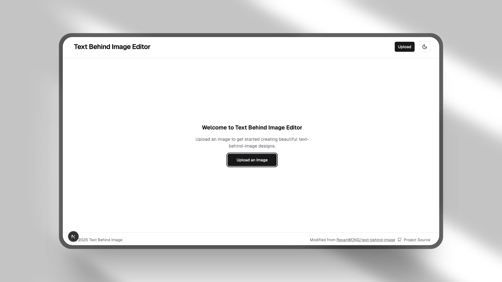

# Text Behind Image Mini (Static Version)

This project is a modified version of the original [text-behind-image](https://github.com/RexanWONG/text-behind-image) by RexanWONG.

demo: https://text-behind-image-mini.vercel.app


## Key Changes:

*   **Static Export:** The project has been configured for full static export (`output: 'export'` in `next.config.mjs`). It can be deployed to any static hosting provider.
*   **Supabase Removed:** All Supabase integrations, including authentication and subscriptions, have been removed.
*   **Updated Dependencies:** Project dependencies have been updated to their latest versions.
*   **Simplified Features:** The focus is solely on the core text-behind-image editing functionality.

## Local Development

1. clone this repo
2. ```npm install```
3. ```npm run dev```
4. ```npm run build```

Thanks again to the original author for the project. This modified version retains the original license terms.

Modified Based on commit: https://github.com/RexanWONG/text-behind-image/commit/08f38a68f43d0b9225e20ae4526fe0c58d7bb349
